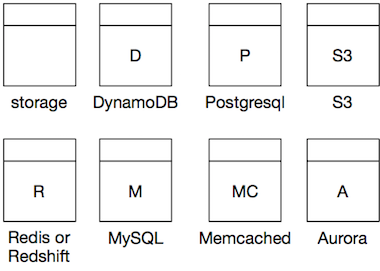

# Data Storage

Sooner or later you want to retrieve or store some data somewhere. When modelling a pipeline it doesn’t always matter where. Especially when working at high abstraction levels you don’t want to make a choice of data store (just yet). We model a data store after a common symbol for a relational database table in UML, but don’t be fooled, the symbol just represent “a datastore” not a relational datastore specifically. 

We mark the type of the datastore by the first letter or a short abbreviation of the actual datastore. 

## Origin of the Symbol

Modelled after the table and class icons in UML. It’s easy to draw on a whiteboard Start with something that comes close to a square and then at about 1/5th of the top, draw a horizontal line. In software, draw a square first, then position a small rectangle on top and join the shapes. That way you can write the letter of your datastore in the centre of the bottom rectangle.

## Data Store Types

Below is a non extensive list of data store types. As with the processors the
naming is (roughly) as follows:

* Use the first letter of the data store, capitalized. Unless the datastore has
  a standard abbreviation of 2 characters.
* If the resulting letter is ambiguous, this is no problem if it's clear (to you
  and your team) from the diagram what the data store is. 
* To disambiguate add an extra letter, or a '.'.
* For Aurora, add the the A after the database type.

| Data store         | Symbol |
| ----------         | ------ |
| DynamoDB           | D      |
| Postgresql         | P      |
| S3                 | S3     |
| Redis or Redshift  | R      |
| Redis              | RD     |
| RedShift           | RS     |
| MySQL or Memcached | M      |
| MySQL              | M.     |
| Memcached          | MD     |
| Microsoft SQL      | MS     |
| Aurora             | A      |
| Aurora MySQL       | MA     |
| Aurora Postgres    | PA     |
| Memcached          | MC     |
| Oracle             | O      |

## Tables

The icon for a datastore is used to mark an individual table or collection. For example, if you indicate you want to store something in MySQL you use a datastore icon for each table you are accessing data from or writing into. Same goes for DynamoDB: you draw a data store for each table. For S3, you draw 1 data store icon per bucket. etc.
