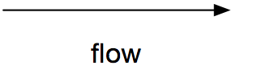
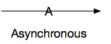
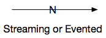
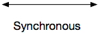
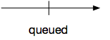

# Flow

Flow of data is represented by arrows. The data flows from the straight end towards the arrowhead. So if a processor requests data from a datastore you would see the arrow head attached to the processor. And if a processor writes data into a datastore, the arrowhead will be touching the datastore.

## Origin of the Symbol

It’s an arrow. The symbols to denote the different types are chosen in a way that you can add them to a line afterwards, and that removing them from a line doesn’t need a whiteboard wiper. (but might give you a bit of  paint on your finger)

## Flow Types

| flow type | image | description |
| --------- | ----- | ----------- |
| flow |  | *An arrow with 1 arrow head.* |
| Asynchronous invocation |  | *Line marked with a capital A on the line. where the (imaginary) dash of the A lines up with the line and can be omitted.* |
| Steaming or evented flow|  | *Line marked with a N on the line.* This line can be used to depict Kinesis streams, DynamoDB update streams, Kinesis Firehoses or streams on a Kafka topic.|
| Synchronous |  | *A line with 2 arrow heads.* | 
| Queued |  | *A line marked with a 90 degree angled "stop line" midway.* |

## Synchronous or bi-directional?

We make no difference. If you execute a process synchronously you are apparently interested in the result of that function, hence you both send (invoke) and receive (get the return value) of that function. 

In cases where you fire and forget into a system but read back from that same system at a later point in time you can draw 2 arrows.

## Limitations limitations

Let your models tell you something about your models. If you need too many arrows, arrows start crossing or you start having more than 1 arrow between 2 components, take a look at your design. Can it be simplified?

