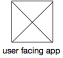
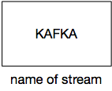
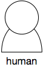
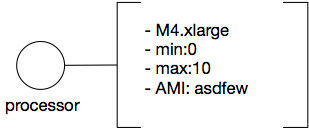
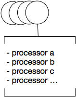
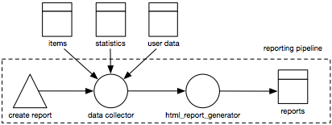

# Miscellaneous

A couple of other icons have proven to be useful in designing and annotating pipelines.

## User facing app

Data pipelines tend to be a computer only business. However, humans often need to configure or change configurations or peek into the data. For that reason we have a user facing app icon. A square with a diagonal cross inside. It’s easy to draw and not easily confused with the external component and the data sources.

## Other kinds of systems

A rectangle. If possible with a description of the external system inside the rectangle, and possibly an extra annotation on the label. The example image shows an external Kafka system.
By writing the name of the system in the rectangle you can use the label for an extra annotation. For example the name of the kafka stream.

## Humans

It’s nice to be able to put some humans in a picture, especially when you add names or roles to the picture.

## Annotations

Sometimes you want to write just a little bit more than a processor or data store name. You can annotate any element in the picture by writing text and using a left and right outer line on a rectangle. Like shown next to this text.  In software packages it is enough just to provide the left and right edge of a box. On the whiteboard it helps to go “just a little around the corner” in order to have the human eye catch the box. 

Why this shape? And why left and right? Because its easy to write your text first and annotate afterwards by drawing a “box without lines” around it. If you want to extend your text you only have to remove the top or bottom 2 small edges.

## Lists and repetitions

Sometimes you run a list of processors in a pipeline that all do the same. For processors this is depicted by overlapping circles, on a whiteboard often drawn as a spiral. Next to the spiral you can optionally annotate the list of processors with a bounding box with the top and bottom lines coloured.

## Grouping

Sometimes you want to group some items together. To indicate a separate AWS account or VPC, or indicate developer responsibilities. For grouping we use a dashed bounding box with a label attached to it on the outside.

