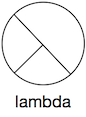
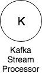
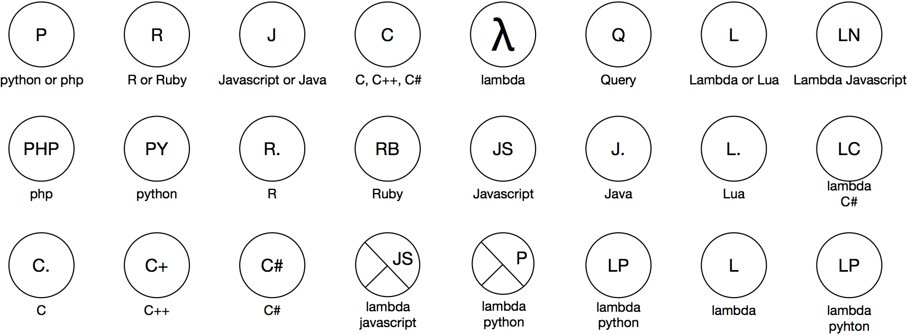

# Processors

A processor is a piece of software that takes takes input data, processes it and writes its output. A processor can be “always on”, or can be triggered by an event or manual action. A processor can take its input from a data store or from a queue or stream. Likewise its output. 

## Origin of the Symbol

A circle is one of the easiest shapes to draw on a whiteboard and has some nice space inside to annotate the type of a processor.

## Processor Types

Currently there are symbols for 2 processor types:

*	Standard (whatever that means for you).
*	Lambda processors, referring to Amazon AWS Lambda functions.

## What’s in a processor?

A “standard” processor can represent a lot. In the case of a non-lambda processor it can mean that there is a cloud formation stack that creates everything necessary to launch 1 or more instances of the processor in an autoscaling group. It probably also means that there is an automated build and release process, a git repository, cloudwatch logs and all other types luxuries that belong to a piece of software. Not bad for just a circle.

