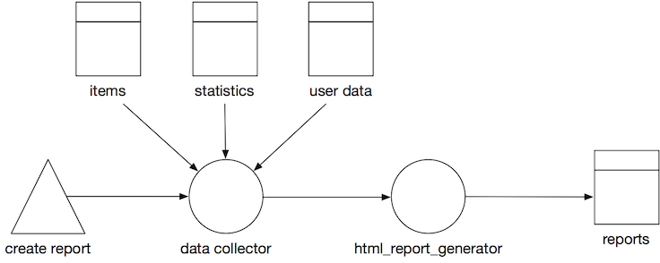
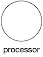
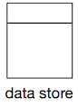
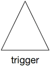
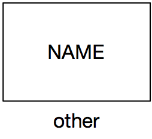
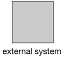

# Pipeline Modeling Language

## Introduction

Diagrams are a good help when designing, describing or explaining how systems work. In order to help with the design and explanation of data pipelines (on AWS) we created a modelling language. The models capture data pipelines, their components and inter-connections  

The visual language is “white board proof” meaning that it can easily be drawn on a whiteboard but it is also made suitable to use basic tools like keynote and powerpoint, or slightly more advanced modelling tools like omnigraffle and Visio.

The models gradually stiffens during a design. You can design your high level pipeline using only a couple of simple symbols and dive into more details of your architecture later by the basic shapes. We hope this helps you keep your focus at the right abstraction level. 

## What is a pipeline

A pipeline is any path that manipulates and stores data. It starts at a trigger or event, data gets processed and ends in a data store. Often you can spot pipelines by following the code path arrows that connects 2 datastore. A pipeline can consist of many other pipelines. In general we would say: if you can slap a name on a process between 2 datastores, it probably is, or should become a pipeline. 

## Creating Pipeline Models

We created a set of figures to use when modelling your data pipelines with [draw.io](https://draw.io). 

In order to use the figures in [draw.io](https://draw.io) follow the following steps:

1. Go to [draw.io](https://draw.io) and create a new diagram.
2. From the menu bar, select `File` > `Open Library from` > `URL`.
3. Enter the following URL `https://raw.githubusercontent.com/Sparkboxx/pipeline-modelling/master/attachments/Data%20Pipeline.xml`.

The shapes library on the left should now contain a section called Data Pipeline.

## Basic Shapes

There are a few basic shapes: circles, double-squares, triangles, arrows and rectangles. If you can draw these shapes you can model data pipelines on a whiteboard or cobble sketches together in a tool like powerpoint or keynote. 

| Shape | Image | Description |
| ----- | ----- | ----------- |
| Processor  |    | *Circle with an optional type indication inside. Name Required.*    A processor is a component that takes takes input data, processes it and writes its output. This normally means a processor transforms the input data into something new. A processor can be “always on”, or can be triggered by an event or manual action. A processor can take its input and send its output anywhere: a data store, a queue, a stream or another processor. Likewise for its output. |
| Data Store |  | *Square with a rectangular bar on top. the main square can contain a type indication. Name required.*    A data store is a persistent or temporary datastore of any type. The definition is quite liberal. S3 is seen as a key value store and uses the same symbol as a.o DynamoDB and Postgresql. |
| Trigger    |        | *Triangle with a possible type indication inside. Name Optional.*    A trigger is a process that kicks of a pipeline.                                                                                                                                                                            |
| Flow       |              | *Arrow with at least 1 arrow head that indicates the flow of data. Name optional.*    Flow is the connection between processors, storage and triggers. Flow comes in different types: synchronous, asynchronous, queued and streaming.                                                                       |
| Other      |            | *Rectangle, no fill, identifier inside. Name optional.*    If it isn’t a processor, a data store or a trigger. It’s probably something else. Represented by a rectangle. There are some variations on the “other” icon, but if it fits, write the name of the system in the rectangle. |
| External   |      | *Rectangle, solid fill. Name required.*    Sometimes you simply don’t care, do you? When your boundaries are strong it’s often enough to model an external system as a black box.                                                                                      |

## Document Source

The source of this documentation can be found in [github](https://github.com/Sparkboxx/pipeline-modelling). This
documentation is automatically built into [sparkboxx.github.io/pipeline-modelling](https://sparkboxx.github.io/pipeline-modelling/).

