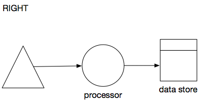
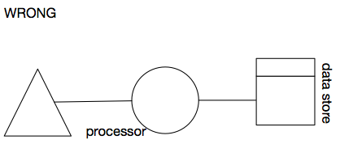

# Modeling Rules

There are some basic guidelines on the modelling of pipelines.

*	Processors, data stores and external systems need names. 
*	Names are optional for flows and triggers. 
*	Names can be written down above or below the icon. Try to avoid putting a name on the side of the icon.
*	If it can be avoided, do not rotate names. With a bit of creativity you can probably find a way to write a name above or below a shape.
*	Try not to forget to put arrow markers on flow lines. That way it’s clear what the flow of data is. When data flows both ways, put 2 arrow heads on the flow line.

 

