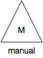
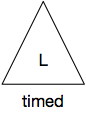
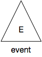

# Triggers

Triggers are the starts of pipelines. A trigger can be manual, event or timed (e.g. cron).  

## Origin of the Symbol

The circle and rectangle like symbols were taken. So we picked the triangle next. 

## Processor Types

Currently there are symbols for 4 trigger types:

| trigger type | image | description |
| ------------ | ----  | ----------- |
| standard |  | |
| manual trigger |  | A manual trigger is a trigger that a human manually triggers. This can be by pressing buttons in the was console, using a CLI command or by pressing a button on a website. |
| timed trigger |  | A timed trigger is a trigger that somehow runs on a timed schedule. The most likely timed trigger is a small piece of code that runs regularly using something like cron. An example of a timed trigger is an AWS Lambda function that runs according to timed cloud watch events. The timed trigger is denoted by a capital L. Where the L stands for the two hands of a clock. On a whiteboard you might actually make it look more like a 2 o'clock symbol. |
| event trigger |  | An evented trigger executes when an event happens. An event could be a cloud watch alarm or a custom cloud watch event firing a lambda function. |

## Double type triggers

A manual trigger is the “most basic” trigger, since you will normally see that each trigger can somehow be manually invoked. Therefore, if the same trigger is of 2 types, e.g. manual and typed, we only model the typed version. 

An example of this is a lambda function that starts a pipeline. The lambda itself is seen as the trigger in this case. If that lambda gets invoked by hand, through the aws cli or console, this is seen as a manual trigger.

